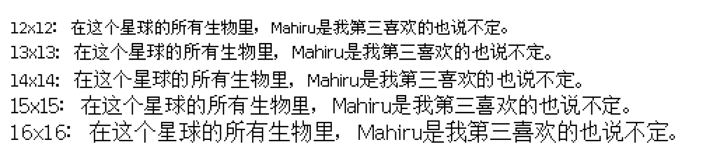

# WenQuanYiBitmapSong

基于[文泉驿点阵宋体](http://wenq.org/wqy2/index.cgi?BitmapSong)构建的矢量点阵风格汉字TrueType字体，适用于现代操作系统和Web页面的点阵风格汉字显示，提供12x12像素至16x16像素共五种版本，使用授权与文泉驿点阵宋体一致。

## WenQuanYiBitmapSong 12

12x12像素矢量点阵风格汉字TrueType字体，基于文泉驿点阵宋体9号生成，字形数30165。

## WenQuanYiBitmapSong 13

13x13像素矢量点阵风格汉字TrueType字体，基于文泉驿点阵宋体10号生成，字形数30144。

## WenQuanYiBitmapSong 14

14x14像素矢量点阵风格汉字TrueType字体，基于文泉驿点阵宋体10.5号生成，字形数22825，**缺少大部分中日韩统一表意文字扩展区A中的文字，建议谨慎使用，一种解决方案是对于缺失文字回退到13x13像素渲染。**。

## WenQuanYiBitmapSong 15

15x15像素矢量点阵风格汉字TrueType字体，基于文泉驿点阵宋体11号生成，字形数30088。

## WenQuanYiBitmapSong 16

16x16像素矢量点阵风格汉字TrueType字体，基于文泉驿点阵宋体12号生成，字形数30085。
